# Brain Cabinet ER図

## 全体概要

このデータベースは **Drizzle ORM + SQLite** で構成されており、ノート管理、セマンティッククラスタリング、思考パターン分析、間隔反復学習の機能を持っています。

---

## ER図 (Mermaid)

```mermaid
erDiagram
    %% ========================================
    %% Core Tables
    %% ========================================

    notes {
        TEXT id PK "UUID"
        TEXT title "NOT NULL"
        TEXT path "NOT NULL"
        TEXT content "NOT NULL"
        TEXT tags "JSON array"
        TEXT category "技術/心理/健康/仕事/etc"
        TEXT headings "JSON array"
        INTEGER clusterId FK "→ clusters.id"
        INTEGER createdAt "Unix timestamp"
        INTEGER updatedAt "Unix timestamp"
    }

    noteHistory {
        TEXT id PK "UUID"
        TEXT noteId FK "→ notes.id"
        TEXT content "NOT NULL (snapshot)"
        TEXT diff "optional"
        TEXT semanticDiff "0.0-1.0"
        INTEGER prevClusterId "before change"
        INTEGER newClusterId "after change"
        INTEGER createdAt "NOT NULL"
    }

    noteRelations {
        TEXT id PK "UUID"
        TEXT sourceNoteId FK "→ notes.id"
        TEXT targetNoteId FK "→ notes.id"
        TEXT relationType "similar/derived/reference/summary_of"
        TEXT score "similarity score"
        INTEGER createdAt
    }

    noteEmbeddings {
        TEXT noteId PK "→ notes.id"
        BLOB embedding "NOT NULL"
        TEXT model "text-embedding-3-small"
        INTEGER dimensions "1536"
        REAL vectorNorm "magnitude"
        REAL semanticDiff
        INTEGER clusterId FK "→ clusters.id"
        INTEGER createdAt
        INTEGER updatedAt
    }

    %% ========================================
    %% Clustering & Analysis
    %% ========================================

    clusters {
        INTEGER id PK "0 to k-1"
        TEXT centroid "Base64 vector"
        INTEGER size "note count"
        TEXT sampleNoteId FK "→ notes.id"
        INTEGER createdAt
        INTEGER updatedAt
    }

    clusterHistory {
        INTEGER id PK "autoincrement"
        TEXT noteId FK "→ notes.id"
        INTEGER clusterId FK "→ clusters.id"
        INTEGER assignedAt
    }

    clusterDynamics {
        INTEGER id PK "autoincrement"
        TEXT date "YYYY-MM-DD"
        INTEGER clusterId FK "→ clusters.id"
        BLOB centroid "Float32Array"
        REAL cohesion "0.0-1.0"
        INTEGER noteCount
        TEXT interactions "JSON"
        REAL stabilityScore
        TEXT createdAt
    }

    conceptGraphEdges {
        INTEGER id PK "autoincrement"
        INTEGER sourceCluster FK "→ clusters.id"
        INTEGER targetCluster FK "→ clusters.id"
        REAL weight "0.0-1.0"
        REAL mutual "bidirectional"
        INTEGER lastUpdated
    }

    %% ========================================
    %% Influence & Drift
    %% ========================================

    noteInfluenceEdges {
        INTEGER id PK "autoincrement"
        TEXT sourceNoteId FK "→ notes.id"
        TEXT targetNoteId FK "→ notes.id"
        REAL weight "0.0-1.0"
        REAL cosineSim
        REAL driftScore
        INTEGER createdAt
    }

    driftEvents {
        INTEGER id PK "autoincrement"
        INTEGER detectedAt
        TEXT severity "low/mid/high"
        TEXT type "cluster_bias/drift_drop/over_focus/stagnation/divergence"
        TEXT message
        INTEGER relatedCluster FK "→ clusters.id (optional)"
        INTEGER resolvedAt "optional"
    }

    %% ========================================
    %% Metrics & Analytics
    %% ========================================

    metricsTimeSeries {
        TEXT date PK "YYYY-MM-DD"
        INTEGER noteCount
        REAL avgSemanticDiff
        INTEGER dominantCluster FK "→ clusters.id"
        REAL entropy "Shannon entropy"
        BLOB growthVector
        INTEGER createdAt
    }

    ptmSnapshots {
        INTEGER id PK "autoincrement"
        INTEGER capturedAt
        BLOB centerOfGravity "thinking center"
        BLOB clusterStrengths
        BLOB influenceMap
        REAL imbalanceScore "0.0-1.0"
        BLOB growthDirection
        TEXT summary "GPT report"
    }

    %% ========================================
    %% Workflow & Jobs
    %% ========================================

    workflowStatus {
        INTEGER id PK "autoincrement"
        TEXT workflow "reconstruct"
        TEXT status "idle/running/completed/failed"
        TEXT progress "JSON"
        TEXT clusterJobId FK "→ jobStatuses.id"
        INTEGER startedAt
        INTEGER completedAt
        TEXT error
    }

    jobStatuses {
        TEXT id PK "UUID"
        TEXT type "NOTE_ANALYZE/CLUSTER_REBUILD/etc"
        TEXT status "pending/running/completed/failed"
        TEXT payload "JSON"
        TEXT result "JSON"
        TEXT error
        INTEGER progress "0-100"
        TEXT progressMessage
        INTEGER createdAt
        INTEGER startedAt
        INTEGER completedAt
    }

    %% ========================================
    %% v4 Decision-First
    %% ========================================

    noteInferences {
        INTEGER id PK "autoincrement"
        TEXT noteId FK "→ notes.id"
        TEXT type "decision/learning/scratch/emotion/log"
        TEXT intent "architecture/design/implementation/etc"
        REAL confidence "0.0-1.0"
        TEXT confidenceDetail "JSON breakdown"
        TEXT decayProfile "stable/exploratory/situational"
        TEXT model "rule-v1/gpt-4.1/local-ml"
        TEXT reasoning
        INTEGER createdAt
    }

    promotionNotifications {
        INTEGER id PK "autoincrement"
        TEXT noteId FK "→ notes.id"
        TEXT triggerType "confidence_rise/frequency/pattern_match"
        TEXT source "realtime/batch"
        TEXT suggestedType "decision/learning"
        TEXT reason
        REAL confidence
        TEXT reasonDetail "JSON"
        TEXT status "pending/dismissed/promoted"
        INTEGER createdAt
        INTEGER resolvedAt
    }

    decisionCounterevidences {
        INTEGER id PK "autoincrement"
        TEXT decisionNoteId FK "→ notes.id"
        TEXT type "regret/missed_alternative/unexpected_outcome/contradiction"
        TEXT content
        TEXT sourceNoteId FK "→ notes.id (optional)"
        REAL severityScore "0.0-1.0"
        TEXT severityLabel "minor/major/critical"
        INTEGER createdAt
    }

    %% ========================================
    %% v4.5 Spaced Review
    %% ========================================

    reviewSchedules {
        INTEGER id PK "autoincrement"
        TEXT noteId FK "→ notes.id"
        REAL easinessFactor "SM-2 EF (1.3+)"
        INTEGER interval "days"
        INTEGER repetition "success count"
        INTEGER nextReviewAt "Unix timestamp"
        INTEGER lastReviewedAt
        TEXT scheduledBy "auto/manual"
        INTEGER isActive "1=active"
        INTEGER createdAt
        INTEGER updatedAt
    }

    recallQuestions {
        INTEGER id PK "autoincrement"
        TEXT noteId FK "→ notes.id"
        TEXT questionType "recall/concept/reasoning/application/comparison"
        TEXT question
        TEXT expectedKeywords "JSON array"
        TEXT source "template/llm"
        INTEGER isActive
        TEXT contentHash
        INTEGER createdAt
        INTEGER updatedAt
    }

    reviewSessions {
        INTEGER id PK "autoincrement"
        TEXT noteId FK "→ notes.id"
        INTEGER scheduleId FK "→ reviewSchedules.id"
        INTEGER quality "SM-2: 0-5"
        INTEGER responseTimeMs
        INTEGER questionsAttempted
        INTEGER questionsCorrect
        REAL easinessFactorBefore
        REAL easinessFactorAfter
        INTEGER intervalBefore
        INTEGER intervalAfter
        INTEGER createdAt
    }

    %% ========================================
    %% Relationships
    %% ========================================

    %% Core relationships
    notes ||--o{ noteHistory : "has history"
    notes ||--o| noteEmbeddings : "has embedding"
    notes ||--o{ noteRelations : "source"
    notes ||--o{ noteRelations : "target"
    notes }o--o| clusters : "belongs to"

    %% Cluster relationships
    clusters ||--o{ clusterHistory : "tracks"
    clusters ||--o{ clusterDynamics : "daily snapshots"
    clusters ||--o{ conceptGraphEdges : "source"
    clusters ||--o{ conceptGraphEdges : "target"
    clusters ||--o{ noteEmbeddings : "contains"

    %% Influence & Drift
    notes ||--o{ noteInfluenceEdges : "source"
    notes ||--o{ noteInfluenceEdges : "target"
    clusters ||--o{ driftEvents : "related (optional)"

    %% Metrics
    clusters ||--o{ metricsTimeSeries : "dominant (optional)"

    %% Workflow
    jobStatuses ||--o{ workflowStatus : "cluster job"

    %% v4 Decision-First
    notes ||--o{ noteInferences : "inferred type"
    notes ||--o{ promotionNotifications : "promotion alerts"
    notes ||--o{ decisionCounterevidences : "decision evidence"
    notes ||--o{ decisionCounterevidences : "source (optional)"

    %% v4.5 Spaced Review
    notes ||--o{ reviewSchedules : "scheduled for review"
    notes ||--o{ recallQuestions : "has questions"
    notes ||--o{ reviewSessions : "review history"
    reviewSchedules ||--o{ reviewSessions : "sessions"
```



---

## テーブル分類

### 1. コアテーブル (Core)
| テーブル | 説明 |
|---------|------|
| `notes` | メインのノート保存テーブル |
| `noteHistory` | ノートの変更履歴 |
| `noteRelations` | ノート間の関係（similar, derived, etc） |
| `noteEmbeddings` | ベクトル埋め込み（類似検索用） |

### 2. クラスタリング & 分析 (Clustering)
| テーブル | 説明 |
|---------|------|
| `clusters` | k-meansクラスタ定義 |
| `clusterHistory` | ノートのクラスタ遷移履歴 |
| `clusterDynamics` | 日次クラスタスナップショット |
| `conceptGraphEdges` | クラスタ間の影響関係 |

### 3. 影響 & ドリフト検出 (Influence & Drift)
| テーブル | 説明 |
|---------|------|
| `noteInfluenceEdges` | ノート間の影響関係 |
| `driftEvents` | 思考パターンの異常検出 |

### 4. メトリクス & 分析 (Metrics)
| テーブル | 説明 |
|---------|------|
| `metricsTimeSeries` | 日次集計メトリクス |
| `ptmSnapshots` | 個人思考モデルのスナップショット |

### 5. ワークフロー & ジョブ (Workflow)
| テーブル | 説明 |
|---------|------|
| `workflowStatus` | ワークフロー実行状態 |
| `jobStatuses` | バックグラウンドジョブキュー |

### 6. v4 Decision-First
| テーブル | 説明 |
|---------|------|
| `noteInferences` | ノートの型・意図推論 |
| `promotionNotifications` | 型昇格通知 |
| `decisionCounterevidences` | 意思決定への反証記録 |

### 7. v4.5 間隔反復学習 (Spaced Review)
| テーブル | 説明 |
|---------|------|
| `reviewSchedules` | SM-2アルゴリズムによるスケジュール |
| `recallQuestions` | アクティブリコール用の質問 |
| `reviewSessions` | レビューセッション記録 |

---

## 主要な外部キー関係

```
notes (ハブ)
├── noteHistory (1:N)
├── noteEmbeddings (1:1)
├── noteInferences (1:N)
├── promotionNotifications (1:N)
├── decisionCounterevidences (1:N)
├── reviewSchedules (1:N)
├── recallQuestions (1:N)
├── reviewSessions (1:N)
├── noteRelations (1:N × 2: source/target)
└── noteInfluenceEdges (1:N × 2: source/target)

clusters (ハブ)
├── noteEmbeddings (1:N)
├── notes (1:N)
├── clusterHistory (1:N)
├── clusterDynamics (1:N)
├── conceptGraphEdges (1:N × 2: source/target)
└── driftEvents (optional)

reviewSchedules
└── reviewSessions (1:N)

jobStatuses
└── workflowStatus (optional)
```

---

## 技術情報

- **ORM:** Drizzle ORM
- **DB:** SQLite (LibSQL client)
- **WAL Mode:** 有効（並行アクセス対応）
- **Busy Timeout:** 5000ms
- **ファイル:** `./data.db`
