# Brain Cabinet ER図

## 全体概要

このデータベースは **Drizzle ORM + SQLite** で構成されており、ノート管理、セマンティッククラスタリング、思考パターン分析、間隔反復学習、LLM推論、コーチング機能を持っています。

**v7.1.0: 全38テーブル**

---

## ER図 (Mermaid)

```mermaid
erDiagram
    %% ========================================
    %% Core Tables
    %% ========================================

    notes {
        TEXT id PK "UUID"
        TEXT title "NOT NULL"
        TEXT path "NOT NULL"
        TEXT content "NOT NULL"
        TEXT tags "JSON array"
        TEXT category "技術/心理/健康/仕事/etc"
        TEXT headings "JSON array"
        TEXT perspective "engineer/po/user/cto/team/stakeholder"
        INTEGER clusterId FK
        INTEGER createdAt "Unix timestamp"
        INTEGER updatedAt "Unix timestamp"
        INTEGER deletedAt "soft delete"
    }

    noteHistory {
        TEXT id PK "UUID"
        TEXT noteId FK
        TEXT content "NOT NULL (snapshot)"
        TEXT diff "optional"
        TEXT semanticDiff "0.0-1.0"
        TEXT changeType "drift/shift/stable"
        TEXT changeDetail "JSON"
        INTEGER prevClusterId
        INTEGER newClusterId
        INTEGER createdAt "NOT NULL"
    }

    noteRelations {
        TEXT id PK "UUID"
        TEXT sourceNoteId FK
        TEXT targetNoteId FK
        TEXT relationType "similar/derived/reference/summary_of"
        TEXT score "similarity score"
        INTEGER createdAt
    }

    noteEmbeddings {
        TEXT noteId PK
        BLOB embedding "NOT NULL"
        TEXT model "text-embedding-3-small"
        INTEGER dimensions "1536"
        REAL vectorNorm "magnitude"
        REAL semanticDiff
        INTEGER clusterId FK
        INTEGER createdAt
        INTEGER updatedAt
    }

    noteImages {
        INTEGER id PK
        TEXT noteId FK
        TEXT imageData "base64"
        TEXT mimeType
        INTEGER position
        INTEGER createdAt
    }

    %% ========================================
    %% Clustering (Legacy)
    %% ========================================

    clusters {
        INTEGER id PK "0 to k-1"
        TEXT centroid "Base64 vector"
        INTEGER size "note count"
        TEXT sampleNoteId FK
        INTEGER createdAt
        INTEGER updatedAt
    }

    clusterHistory {
        INTEGER id PK
        TEXT noteId FK
        INTEGER clusterId FK
        INTEGER assignedAt
    }

    clusterDynamics {
        INTEGER id PK
        TEXT date "YYYY-MM-DD"
        INTEGER clusterId FK
        BLOB centroid "Float32Array"
        REAL cohesion "0.0-1.0"
        INTEGER noteCount
        TEXT interactions "JSON"
        REAL stabilityScore
        TEXT createdAt
    }

    %% ========================================
    %% Temporal Clustering (v7)
    %% ========================================

    clusteringSnapshots {
        INTEGER id PK
        INTEGER capturedAt
        INTEGER clusterCount
        TEXT algorithm "kmeans"
        TEXT metadata "JSON"
    }

    snapshotClusters {
        INTEGER id PK
        INTEGER snapshotId FK
        INTEGER localClusterId
        BLOB centroid
        INTEGER size
        TEXT label
        TEXT identityId FK
    }

    snapshotNoteAssignments {
        INTEGER id PK
        INTEGER snapshotId FK
        TEXT noteId FK
        INTEGER localClusterId
        REAL distance
    }

    clusterLineage {
        INTEGER id PK
        INTEGER snapshotId FK
        INTEGER localClusterId
        INTEGER predecessorSnapshotId
        INTEGER predecessorClusterId
        REAL similarity
    }

    clusterEvents {
        INTEGER id PK
        INTEGER snapshotId FK
        TEXT eventType "split/merge/extinct/emerge"
        TEXT involvedClusters "JSON"
        TEXT description
        INTEGER detectedAt
    }

    clusterIdentities {
        TEXT id PK "UUID"
        TEXT label
        TEXT description
        INTEGER firstSeenSnapshotId FK
        INTEGER lastSeenSnapshotId FK
        INTEGER createdAt
    }

    %% ========================================
    %% Graph & Analysis
    %% ========================================

    conceptGraphEdges {
        INTEGER id PK
        INTEGER sourceCluster FK
        INTEGER targetCluster FK
        REAL weight "0.0-1.0"
        REAL mutual "bidirectional"
        INTEGER lastUpdated
    }

    noteInfluenceEdges {
        INTEGER id PK
        TEXT sourceNoteId FK
        TEXT targetNoteId FK
        REAL weight "0.0-1.0"
        REAL cosineSim
        REAL driftScore
        INTEGER createdAt
    }

    driftEvents {
        INTEGER id PK
        INTEGER detectedAt
        TEXT severity "low/mid/high"
        TEXT type "cluster_bias/drift_drop/over_focus/stagnation/divergence"
        TEXT message
        INTEGER relatedCluster
        INTEGER resolvedAt
    }

    driftAnnotations {
        INTEGER id PK
        INTEGER driftEventId FK
        TEXT label
        TEXT comment
        INTEGER createdAt
    }

    metricsTimeSeries {
        TEXT date PK "YYYY-MM-DD"
        INTEGER noteCount
        REAL avgSemanticDiff
        INTEGER dominantCluster FK
        REAL entropy "Shannon entropy"
        BLOB growthVector
        INTEGER createdAt
    }

    analysisCache {
        TEXT id PK
        TEXT cacheKey
        TEXT timeScale "day/week/month"
        TEXT data "JSON"
        INTEGER computedAt
        INTEGER expiresAt
    }

    %% ========================================
    %% Inference & Decision
    %% ========================================

    noteInferences {
        INTEGER id PK
        TEXT noteId FK
        TEXT type "decision/learning/scratch/emotion/log"
        TEXT intent "architecture/design/implementation/etc"
        REAL confidence "0.0-1.0"
        TEXT confidenceDetail "JSON breakdown"
        TEXT decayProfile "stable/exploratory/situational"
        TEXT model "rule-v1/gpt-4.1/local-ml"
        TEXT reasoning
        INTEGER createdAt
    }

    llmInferenceResults {
        INTEGER id PK
        TEXT noteId FK
        TEXT provider "openai/ollama"
        TEXT model "gpt-4/llama2"
        TEXT prompt
        TEXT response
        TEXT parsedResult "JSON"
        INTEGER inputTokens
        INTEGER outputTokens
        INTEGER latencyMs
        TEXT status "success/error"
        TEXT error
        INTEGER createdAt
    }

    promotionNotifications {
        INTEGER id PK
        TEXT noteId FK
        TEXT triggerType "confidence_rise/frequency/pattern_match"
        TEXT source "realtime/batch"
        TEXT suggestedType "decision/learning"
        TEXT reason
        REAL confidence
        TEXT reasonDetail "JSON"
        TEXT status "pending/dismissed/promoted"
        INTEGER createdAt
        INTEGER resolvedAt
    }

    decisionCounterevidences {
        INTEGER id PK
        TEXT decisionNoteId FK
        TEXT type "regret/missed_alternative/unexpected_outcome/contradiction"
        TEXT content
        TEXT sourceNoteId FK
        REAL severityScore "0.0-1.0"
        TEXT severityLabel "minor/major/critical"
        INTEGER createdAt
    }

    %% ========================================
    %% Spaced Review
    %% ========================================

    reviewSchedules {
        INTEGER id PK
        TEXT noteId FK
        REAL easinessFactor "SM-2 EF (1.3+)"
        INTEGER interval "days"
        INTEGER repetition "success count"
        INTEGER nextReviewAt "Unix timestamp"
        INTEGER lastReviewedAt
        TEXT scheduledBy "auto/manual"
        INTEGER isActive "1=active"
        TEXT fixedRevisionId FK
        INTEGER createdAt
        INTEGER updatedAt
    }

    recallQuestions {
        INTEGER id PK
        TEXT noteId FK
        TEXT questionType "recall/concept/reasoning/application/comparison"
        TEXT question
        TEXT expectedKeywords "JSON array"
        TEXT source "template/llm"
        INTEGER isActive
        TEXT contentHash
        INTEGER createdAt
        INTEGER updatedAt
    }

    reviewSessions {
        INTEGER id PK
        TEXT noteId FK
        INTEGER scheduleId FK
        INTEGER quality "SM-2: 0-5"
        INTEGER responseTimeMs
        INTEGER questionsAttempted
        INTEGER questionsCorrect
        REAL easinessFactorBefore
        REAL easinessFactorAfter
        INTEGER intervalBefore
        INTEGER intervalAfter
        INTEGER createdAt
    }

    %% ========================================
    %% Workflow & Jobs
    %% ========================================

    workflowStatus {
        INTEGER id PK
        TEXT workflow "reconstruct"
        TEXT status "idle/running/completed/failed"
        TEXT progress "JSON"
        TEXT clusterJobId FK
        INTEGER startedAt
        INTEGER completedAt
        TEXT error
    }

    jobStatuses {
        TEXT id PK "UUID"
        TEXT type "NOTE_ANALYZE/CLUSTER_REBUILD/etc"
        TEXT status "pending/running/completed/failed"
        TEXT payload "JSON"
        TEXT result "JSON"
        TEXT error
        INTEGER progress "0-100"
        TEXT progressMessage
        INTEGER createdAt
        INTEGER startedAt
        INTEGER completedAt
    }

    ptmSnapshots {
        INTEGER id PK
        INTEGER capturedAt
        BLOB centerOfGravity "thinking center"
        BLOB clusterStrengths
        BLOB influenceMap
        REAL imbalanceScore "0.0-1.0"
        BLOB growthDirection
        TEXT summary "GPT report"
    }

    %% ========================================
    %% Bookmarks & Secret Box
    %% ========================================

    bookmarkNodes {
        TEXT id PK "UUID"
        TEXT parentId FK
        TEXT type "folder/note/link"
        TEXT name "NOT NULL"
        TEXT noteId FK
        TEXT url "external link"
        INTEGER position "sort order"
        INTEGER isExpanded "1=expanded"
        TEXT libraryPosition "JSON [x,y,z]"
        TEXT libraryColor
        INTEGER createdAt
        INTEGER updatedAt
    }

    secretBoxFolders {
        TEXT id PK "UUID"
        TEXT name
        TEXT parentId FK
        INTEGER position
        INTEGER createdAt
        INTEGER updatedAt
    }

    secretBoxItems {
        TEXT id PK "UUID"
        TEXT folderId FK
        TEXT title
        TEXT encryptedContent
        TEXT tags "JSON"
        INTEGER position
        INTEGER createdAt
        INTEGER updatedAt
    }

    %% ========================================
    %% Coaching
    %% ========================================

    coachingSessions {
        TEXT id PK "UUID"
        TEXT phase "goal_setting/abstraction/self_talk/integration"
        TEXT status "active/completed/abandoned"
        TEXT goal
        TEXT summary
        INTEGER createdAt
        INTEGER updatedAt
    }

    coachingMessages {
        INTEGER id PK
        TEXT sessionId FK
        TEXT role "user/assistant"
        TEXT content
        TEXT metadata "JSON"
        INTEGER createdAt
    }

    %% ========================================
    %% Pomodoro Timer
    %% ========================================

    pomodoroSessions {
        INTEGER id PK
        TEXT taskDescription
        INTEGER duration "minutes"
        TEXT status "completed/interrupted"
        INTEGER startedAt
        INTEGER endedAt
    }

    pomodoroTimerState {
        INTEGER id PK "singleton"
        TEXT status "idle/running/paused/break"
        INTEGER remainingSeconds
        INTEGER currentSessionId FK
        INTEGER updatedAt
    }

    %% ========================================
    %% Voice Evaluation (v7.3)
    %% ========================================

    voiceEvaluationLogs {
        INTEGER id PK
        TEXT noteId FK
        TEXT ruleId
        TEXT ruleName
        REAL score "0.0-1.0"
        TEXT feedback
        TEXT metadata "JSON"
        INTEGER evaluatedAt
    }

    %% ========================================
    %% Relationships
    %% ========================================

    %% Core relationships
    notes ||--o{ noteHistory : "has history"
    notes ||--o| noteEmbeddings : "has embedding"
    notes ||--o{ noteRelations : "source"
    notes ||--o{ noteRelations : "target"
    notes ||--o{ noteImages : "has images"
    notes }o--o| clusters : "belongs to"

    %% Cluster relationships
    clusters ||--o{ clusterHistory : "tracks"
    clusters ||--o{ clusterDynamics : "daily snapshots"
    clusters ||--o{ conceptGraphEdges : "source"
    clusters ||--o{ conceptGraphEdges : "target"
    clusters ||--o{ noteEmbeddings : "contains"

    %% Temporal Clustering (v7)
    clusteringSnapshots ||--o{ snapshotClusters : "contains"
    clusteringSnapshots ||--o{ snapshotNoteAssignments : "has assignments"
    clusteringSnapshots ||--o{ clusterLineage : "has lineage"
    clusteringSnapshots ||--o{ clusterEvents : "has events"
    snapshotClusters }o--o| clusterIdentities : "identified as"

    %% Influence & Drift
    notes ||--o{ noteInfluenceEdges : "source"
    notes ||--o{ noteInfluenceEdges : "target"
    driftEvents ||--o{ driftAnnotations : "has annotations"

    %% Workflow
    jobStatuses ||--o{ workflowStatus : "cluster job"

    %% Inference
    notes ||--o{ noteInferences : "inferred type"
    notes ||--o{ llmInferenceResults : "LLM inference"
    notes ||--o{ promotionNotifications : "promotion alerts"
    notes ||--o{ decisionCounterevidences : "decision evidence"

    %% Spaced Review
    notes ||--o{ reviewSchedules : "scheduled for review"
    notes ||--o{ recallQuestions : "has questions"
    notes ||--o{ reviewSessions : "review history"
    reviewSchedules ||--o{ reviewSessions : "sessions"
    noteHistory ||--o{ reviewSchedules : "fixed revision"

    %% Bookmarks & Secret Box
    notes ||--o{ bookmarkNodes : "bookmarked"
    bookmarkNodes ||--o{ bookmarkNodes : "parent-child"
    secretBoxFolders ||--o{ secretBoxFolders : "parent-child"
    secretBoxFolders ||--o{ secretBoxItems : "contains"

    %% Coaching
    coachingSessions ||--o{ coachingMessages : "has messages"

    %% Pomodoro
    pomodoroTimerState }o--o| pomodoroSessions : "current session"

    %% Voice Evaluation
    notes ||--o{ voiceEvaluationLogs : "evaluated"
```



---

## テーブル分類

### 1. コアテーブル (5)
| テーブル | 説明 |
|---------|------|
| `notes` | メインのノート保存テーブル |
| `noteHistory` | ノートの変更履歴（changeType, changeDetail含む） |
| `noteRelations` | ノート間の関係 |
| `noteEmbeddings` | ベクトル埋め込み |
| `noteImages` | ノート画像埋め込み |

### 2. クラスタリング - Legacy (3)
| テーブル | 説明 |
|---------|------|
| `clusters` | k-meansクラスタ定義 |
| `clusterHistory` | ノートのクラスタ遷移履歴 |
| `clusterDynamics` | 日次クラスタスナップショット |

### 3. Temporal Clustering - v7 (6)
| テーブル | 説明 |
|---------|------|
| `clusteringSnapshots` | クラスタリングスナップショット世代管理 |
| `snapshotClusters` | スナップショット内クラスタ定義 |
| `snapshotNoteAssignments` | スナップショット内ノート割り当て |
| `clusterLineage` | クラスタ継承関係 |
| `clusterEvents` | クラスタイベント（split/merge/extinct/emerge） |
| `clusterIdentities` | 論理クラスタの永続識別子 |

### 4. グラフ & 分析 (6)
| テーブル | 説明 |
|---------|------|
| `conceptGraphEdges` | クラスタ間の影響関係 |
| `noteInfluenceEdges` | ノート間の影響関係 |
| `driftEvents` | 思考パターンの異常検出 |
| `driftAnnotations` | ドリフトイベントへのユーザーラベル |
| `metricsTimeSeries` | 日次集計メトリクス |
| `analysisCache` | マルチタイムスケール分析キャッシュ |

### 5. 推論 & 判断 (4)
| テーブル | 説明 |
|---------|------|
| `noteInferences` | ノートの型・意図推論 |
| `llmInferenceResults` | LLM推論結果（OpenAI/Ollama） |
| `promotionNotifications` | 型昇格通知 |
| `decisionCounterevidences` | 意思決定への反証記録 |

### 6. Spaced Review (3)
| テーブル | 説明 |
|---------|------|
| `reviewSchedules` | SM-2アルゴリズムによるスケジュール |
| `recallQuestions` | アクティブリコール用の質問 |
| `reviewSessions` | レビューセッション記録 |

### 7. ワークフロー & ジョブ (3)
| テーブル | 説明 |
|---------|------|
| `workflowStatus` | ワークフロー実行状態 |
| `jobStatuses` | バックグラウンドジョブキュー |
| `ptmSnapshots` | 個人思考モデルのスナップショット |

### 8. ブックマーク & Secret Box (3)
| テーブル | 説明 |
|---------|------|
| `bookmarkNodes` | 階層構造のブックマーク管理 |
| `secretBoxFolders` | シークレットBOXフォルダ |
| `secretBoxItems` | シークレットBOXアイテム |

### 9. コーチング (2)
| テーブル | 説明 |
|---------|------|
| `coachingSessions` | コーチングセッション管理 |
| `coachingMessages` | コーチング会話ログ |

### 10. ポモドーロタイマー (2)
| テーブル | 説明 |
|---------|------|
| `pomodoroSessions` | ポモドーロセッション履歴 |
| `pomodoroTimerState` | タイマー状態（シングルトン） |

### 11. Voice Evaluation (1)
| テーブル | 説明 |
|---------|------|
| `voiceEvaluationLogs` | 観測者ルール評価ログ |

---

## 主要な外部キー関係

```
notes (ハブ)
├── noteHistory (1:N)
├── noteEmbeddings (1:1)
├── noteImages (1:N)
├── noteInferences (1:N)
├── llmInferenceResults (1:N)
├── promotionNotifications (1:N)
├── decisionCounterevidences (1:N)
├── reviewSchedules (1:N)
├── recallQuestions (1:N)
├── reviewSessions (1:N)
├── noteRelations (1:N × 2: source/target)
├── noteInfluenceEdges (1:N × 2: source/target)
├── bookmarkNodes (1:N)
├── snapshotNoteAssignments (1:N)
└── voiceEvaluationLogs (1:N)

clusters (ハブ)
├── noteEmbeddings (1:N)
├── notes (1:N)
├── clusterHistory (1:N)
├── clusterDynamics (1:N)
└── conceptGraphEdges (1:N × 2: source/target)

clusteringSnapshots (v7)
├── snapshotClusters (1:N)
├── snapshotNoteAssignments (1:N)
├── clusterLineage (1:N)
└── clusterEvents (1:N)

snapshotClusters
└── clusterIdentities (N:1)

coachingSessions
└── coachingMessages (1:N)

secretBoxFolders
├── secretBoxFolders (自己参照)
└── secretBoxItems (1:N)
```

---

## 技術情報

- **ORM:** Drizzle ORM
- **DB:** SQLite (LibSQL client)
- **WAL Mode:** 有効（並行アクセス対応）
- **ファイル:** `./data.db`

---

最終更新: 2026-01-19
