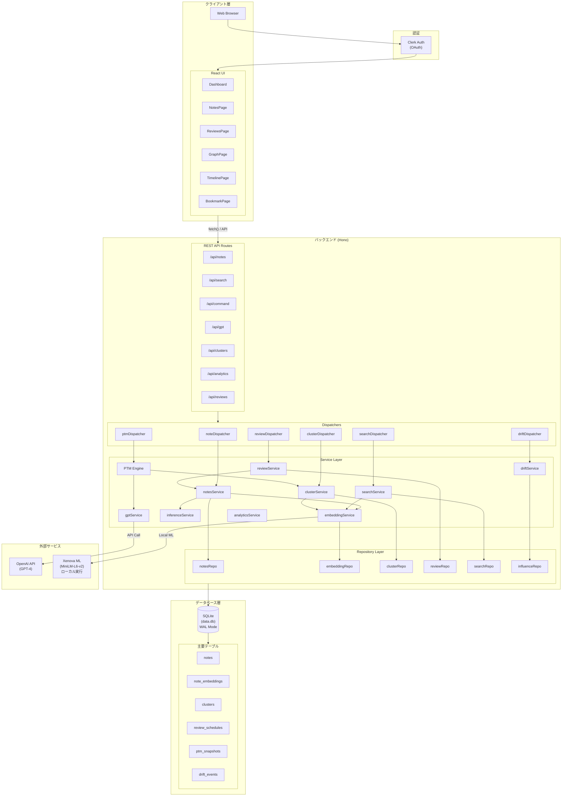
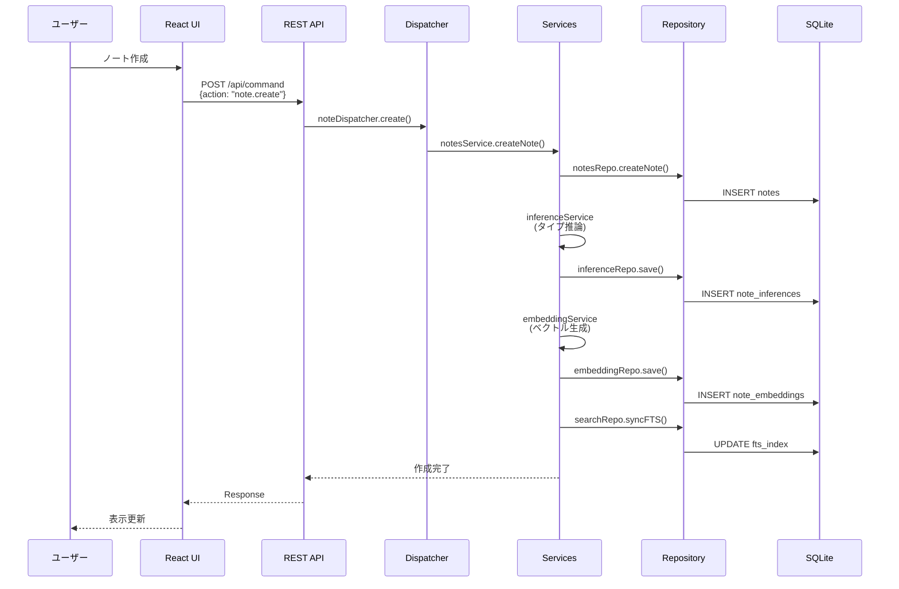
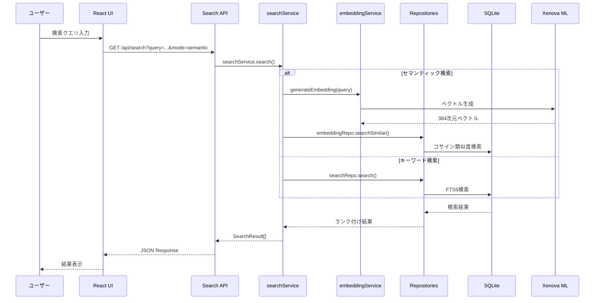
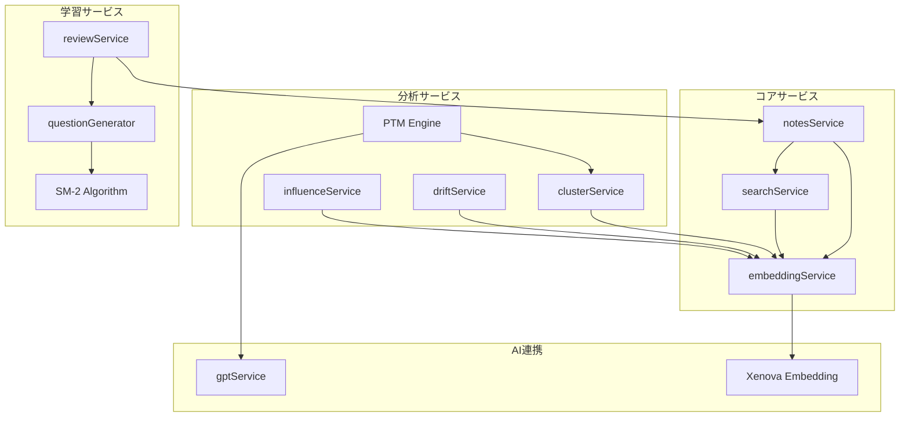
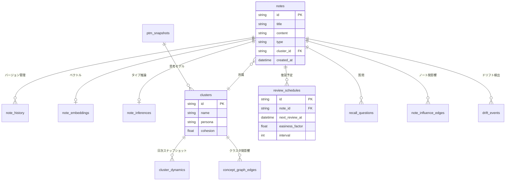
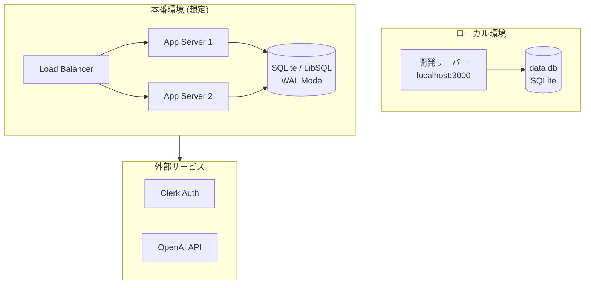

# Brain Cabinet ネットワーク構成図

## システム全体構成

## データフロー詳細

### ノート作成フロー

### 検索フロー

## レイヤー構成

```mermaid
flowchart LR
    subgraph Presentation["プレゼンテーション層"]
        direction TB
        P1["React Components"]
        P2["API Client"]
    end

    subgraph Application["アプリケーション層"]
        direction TB
        A1["Routes"]
        A2["Dispatchers"]
        A3["Services"]
    end

    subgraph Domain["ドメイン層"]
        direction TB
        D1["Repositories"]
        D2["Business Logic"]
    end

    subgraph Infrastructure["インフラ層"]
        direction TB
        I1["SQLite / Drizzle ORM"]
        I2["External APIs"]
        I3["Local ML Models"]
    end

    Presentation --> Application
    Application --> Domain
    Domain --> Infrastructure
```

## コンポーネント依存関係

## 主要テーブル関係

## デプロイ構成

---

## 技術スタック

| レイヤー | 技術 |
|---------|------|
| フロントエンド | React, TypeScript, TailwindCSS |
| バックエンド | Hono (Node.js), TypeScript |
| データベース | SQLite (Drizzle ORM), WAL Mode |
| 認証 | Clerk (OAuth) |
| ML/AI | Xenova/all-MiniLM-L6-v2 (ローカル), OpenAI API |
| ビルド | Vite, esbuild |

## ポート構成

| サービス | ポート | 説明 |
|---------|--------|------|
| Backend API | 3000 | Hono サーバー |
| Frontend Dev | 5173 | Vite 開発サーバー |
| SQLite | - | ファイルベース (data.db) |
