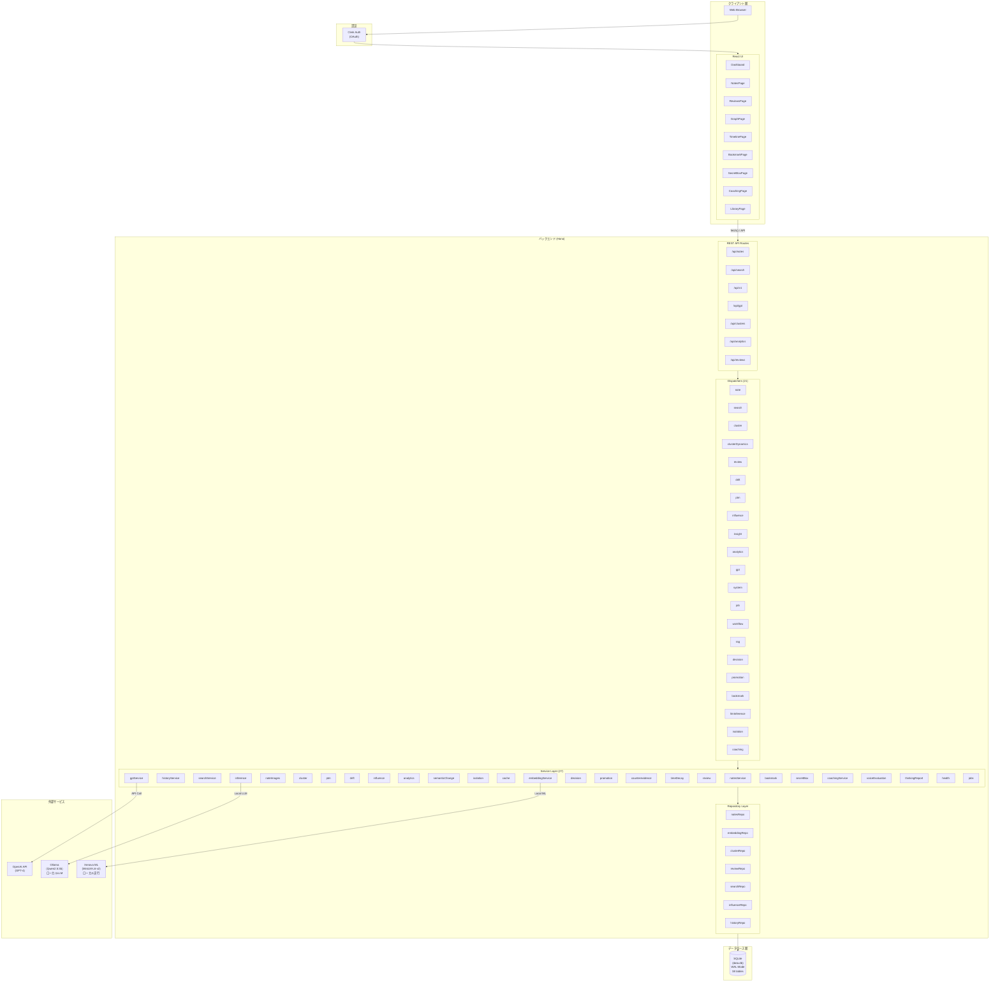
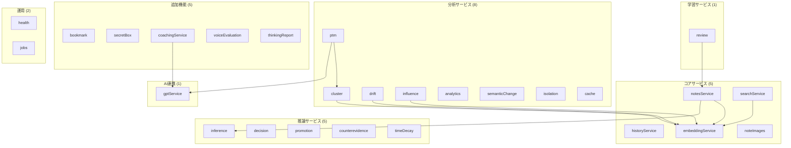
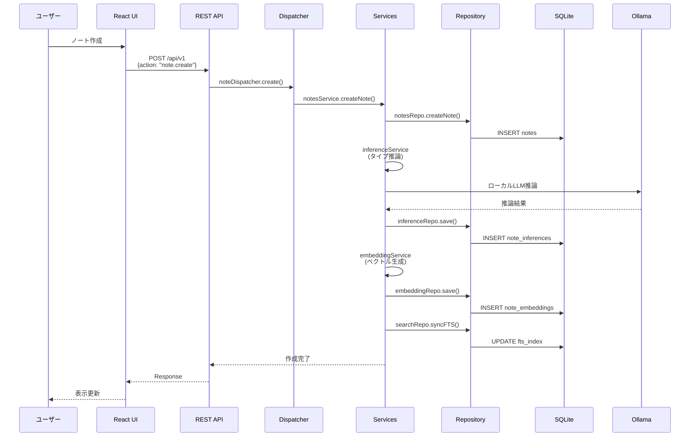
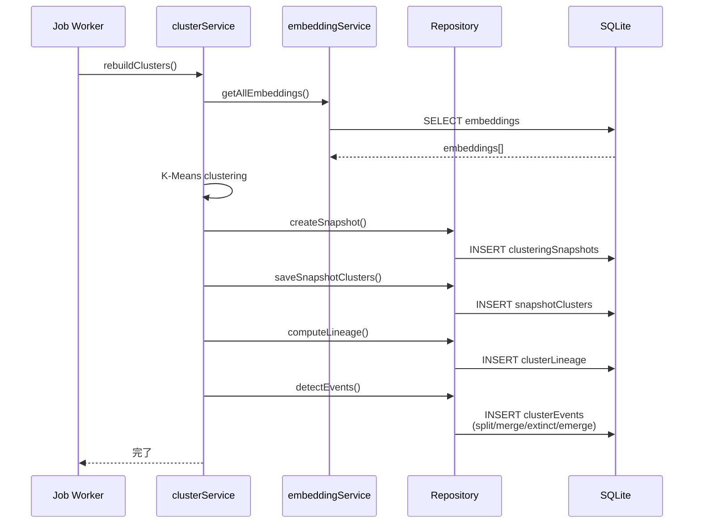

# Brain Cabinet ネットワーク構成図

**v7.1.0**

## システム全体構成

## サービス層詳細

## データフロー詳細

### ノート作成フロー

### Temporal Clustering フロー (v7)

## レイヤー構成

```mermaid
flowchart LR
    subgraph Presentation["プレゼンテーション層"]
        direction TB
        P1["React Components"]
        P2["API Client"]
    end

    subgraph Application["アプリケーション層"]
        direction TB
        A1["Routes"]
        A2["Dispatchers (21)"]
        A3["Services (27)"]
    end

    subgraph Domain["ドメイン層"]
        direction TB
        D1["Repositories"]
        D2["Business Logic"]
    end

    subgraph Infrastructure["インフラ層"]
        direction TB
        I1["SQLite / Drizzle ORM<br/>(38 tables)"]
        I2["External APIs<br/>(OpenAI)"]
        I3["Local LLM<br/>(Ollama)"]
        I4["Local ML<br/>(Xenova)"]
    end

    Presentation --> Application
    Application --> Domain
    Domain --> Infrastructure
```

## ディスパッチャー一覧（21個）

| ディスパッチャー | 主要アクション |
|-----------------|----------------|
| note | create, get, update, delete, list |
| search | query, categories, byTitle |
| cluster | list, get, rebuild |
| clusterDynamics | get |
| drift | getTimeline, getState |
| ptm | latest, history |
| influence | graph, topInfluencers |
| insight | overview, growth |
| analytics | summary |
| gpt | search, context, coachDecision |
| system | health, embed, rebuildFts |
| job | getStatus, list |
| workflow | reconstruct |
| rag | query |
| decision | search, context, compare |
| promotion | getCandidates, dismiss, promote |
| review | queue, start, submit, schedule |
| bookmark | list, create, update, delete |
| llmInference | run, get, list |
| isolation | detect, list |
| coaching | start, message, end |

## サービス一覧（27個）

| カテゴリ | サービス |
|---------|----------|
| コア | notesService, historyService, searchService, embeddingService, noteImages |
| 分析 | cluster, ptm, drift, influence, analytics, semanticChange, isolation, cache |
| 推論 | inference, decision, promotion, counterevidence, timeDecay |
| 学習 | review |
| AI | gptService |
| 追加機能 | bookmark, secretBox, coachingService, voiceEvaluation, thinkingReport |
| 運用 | health, jobs |

---

## 技術スタック

| レイヤー | 技術 |
|---------|------|
| フロントエンド | React, TypeScript, TailwindCSS |
| バックエンド | Hono (Node.js), TypeScript |
| データベース | SQLite (Drizzle ORM), WAL Mode, 38 tables |
| 認証 | Clerk (OAuth) |
| LLM | Ollama (ローカル), OpenAI API |
| ML | Xenova/all-MiniLM-L6-v2 (ローカル) |
| ビルド | Vite, esbuild |

## ポート構成

| サービス | ポート | 説明 |
|---------|--------|------|
| Backend API | 3000 | Hono サーバー |
| Frontend Dev | 5173 | Vite 開発サーバー |
| Ollama | 11434 | ローカルLLMサーバー |
| SQLite | - | ファイルベース (data.db) |

---

最終更新: 2026-01-19
