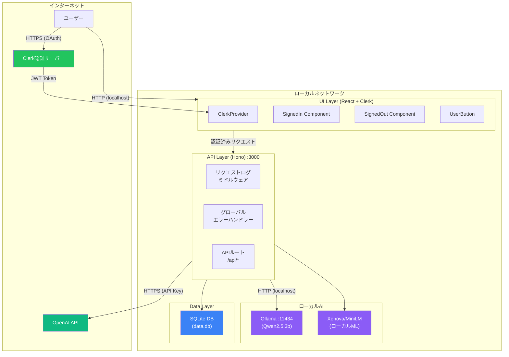
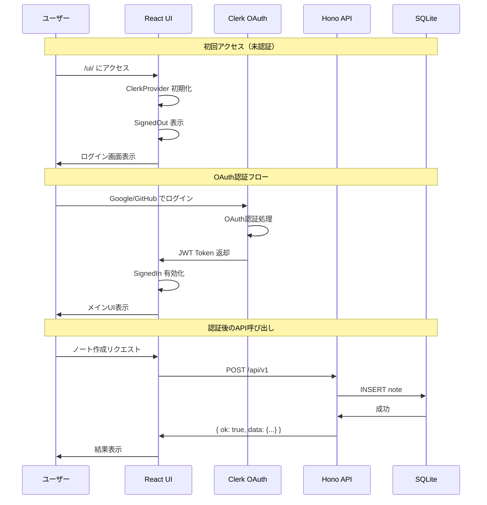
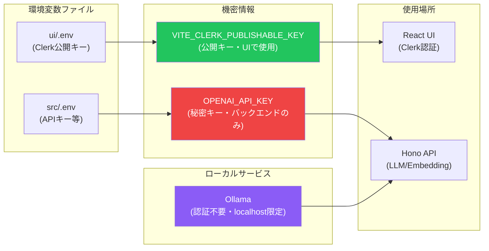
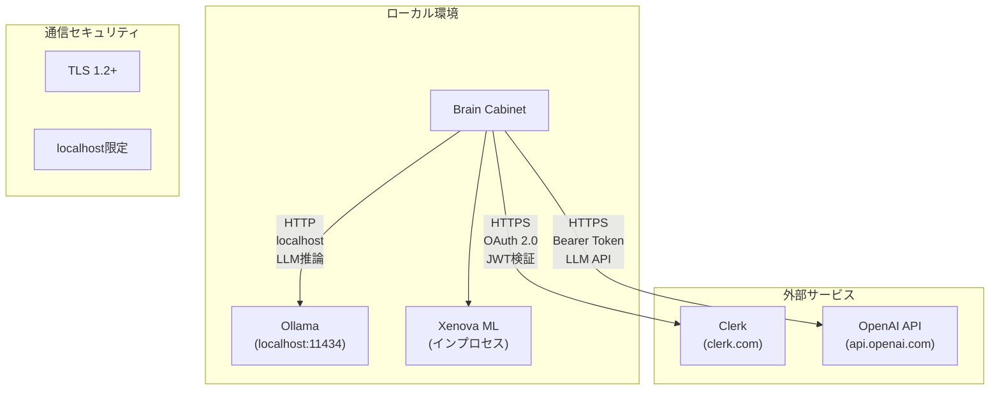
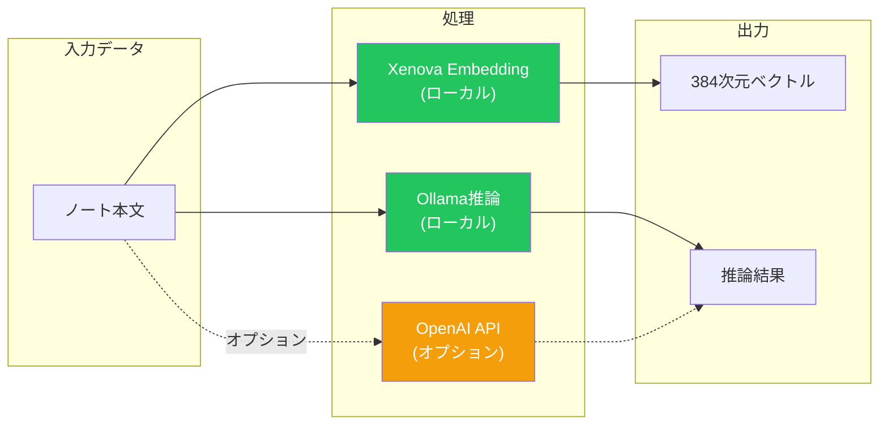
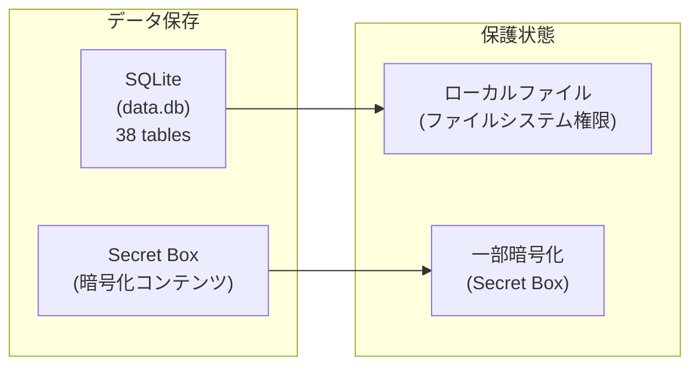
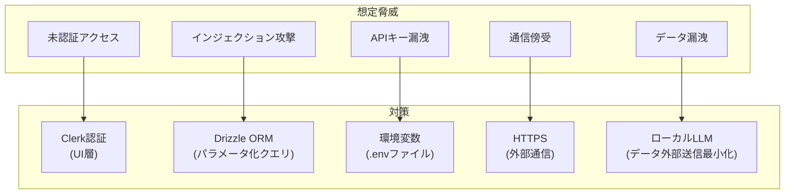

# Brain Cabinet セキュリティ構成図

> v7.1.0 セキュリティアーキテクチャ

---

## 概要

Brain Cabinetのセキュリティは、**フロントエンド認証**（Clerk OAuth）と**ローカル実行モデル**を組み合わせた構成です。個人利用を前提としたシステムのため、バックエンドAPIは認証なしで動作しますが、UI経由のアクセスはClerk認証で保護されています。

v6以降、ローカルLLM（Ollama）を活用することで、外部へのデータ送信を最小化しています。

---

## セキュリティ境界図

---

## 認証フロー

---

## アクセス制御マトリクス

### エンドポイント別アクセス権限

| エンドポイント | 認証 | 説明 |
|--------------|------|------|
| `/` | 不要 | ヘルスチェック |
| `/openapi.json` | 不要 | API仕様書 |
| `/ui/*` | **Clerk必須** | Web UI（SPAフォールバック） |
| `/api/v1` | 不要* | 統合Command API |
| `/api/notes/*` | 不要* | ノートCRUD |
| `/api/search/*` | 不要* | 検索API |
| `/api/gpt/*` | 不要* | GPT連携API |
| `/api/clusters/*` | 不要* | クラスタAPI |
| `/api/bookmarks/*` | 不要* | ブックマークAPI |

> *バックエンドAPIは認証不要ですが、**ローカルホスト限定**での実行を想定しています。外部公開時は追加のセキュリティ対策が必要です。

---

## 機密情報管理

### 環境変数一覧

| 変数名 | 場所 | 種類 | 用途 |
|--------|------|------|------|
| `VITE_CLERK_PUBLISHABLE_KEY` | ui/.env | 公開 | Clerk認証（フロントエンド） |
| `OPENAI_API_KEY` | src/.env | **秘密** | OpenAI API（バックエンド） |

---

## 外部サービス通信

### 外部通信詳細

| サービス | プロトコル | 認証方式 | データ |
|---------|-----------|---------|--------|
| Clerk | HTTPS | OAuth 2.0 / JWT | ユーザー認証情報 |
| OpenAI | HTTPS | Bearer Token | ノートテキスト（LLM推論用） |
| Ollama | HTTP (localhost) | なし | ノートテキスト（ローカルLLM推論） |
| Xenova | インプロセス | なし | ノートテキスト（Embedding生成） |

---

## データフローとプライバシー

### プライバシー保護

| 処理 | デフォルト | データ送信先 |
|------|-----------|-------------|
| Embedding生成 | ローカル（Xenova） | なし |
| ノートタイプ推論 | ローカル（Ollama） | なし |
| GPT連携 | オプション | OpenAI API |

---

## セキュリティ対策

### 実装済み

| 対策 | 説明 |
|------|------|
| **Clerk OAuth** | UI層での認証（Google, GitHub等） |
| **ローカル実行** | localhost限定でAPI公開 |
| **ローカルLLM** | Ollama（Qwen2.5:3b）によるローカル推論 |
| **ローカルML** | Xenova/MiniLMによるローカルEmbedding |
| **エラーハンドリング** | グローバルエラーハンドラーで詳細エラー非公開 |
| **リクエストログ** | 全リクエストのログ記録（Pino） |

### 外部公開時の推奨対策

| 対策 | 優先度 | 説明 |
|------|-------|------|
| **API認証** | 必須 | バックエンドAPIにも認証を追加 |
| **CORS設定** | 必須 | 許可オリジンの制限 |
| **Rate Limiting** | 高 | APIレート制限 |
| **HTTPS強制** | 高 | TLS証明書の導入 |
| **WAF** | 中 | Web Application Firewall |
| **CSP** | 中 | Content Security Policy |

---

## データ保護

### データ分類

| データ種別 | 保存場所 | 暗号化 | バックアップ |
|-----------|---------|--------|-------------|
| ノート本文 | SQLite | なし | ユーザー管理 |
| Embedding | SQLite (BLOB) | なし | ユーザー管理 |
| Secret Box | SQLite | あり | ユーザー管理 |
| 認証情報 | Clerk (外部) | あり | Clerk管理 |

---

## 脅威モデル

---

## 推奨セキュリティチェックリスト

### 開発時

- [ ] `.env` ファイルを `.gitignore` に追加
- [ ] APIキーをハードコードしない
- [ ] 依存パッケージの脆弱性チェック (`pnpm audit`)

### デプロイ時

- [ ] 環境変数を安全に設定
- [ ] HTTPS を有効化
- [ ] 不要なエンドポイントを無効化
- [ ] ファイアウォール設定
- [ ] Ollamaのアクセス制限（localhost限定）

### 運用時

- [ ] 定期的なログ監視
- [ ] 依存パッケージの更新
- [ ] Clerkダッシュボードでのセッション管理
- [ ] Ollamaモデルの更新

---

## 関連ドキュメント

| ドキュメント | 説明 |
|-------------|------|
| [architecture.md](./architecture.md) | システムアーキテクチャ全体 |
| [network-diagram.md](./network-diagram.md) | ネットワーク構成図 |
| [README.md](./README.md) | APIリファレンス |

---

最終更新: 2026-01-19
